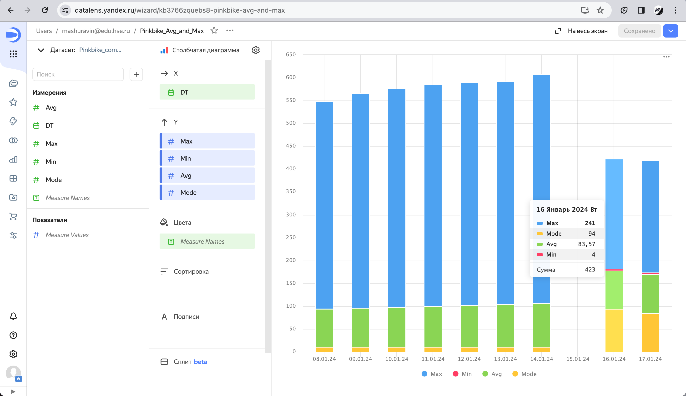
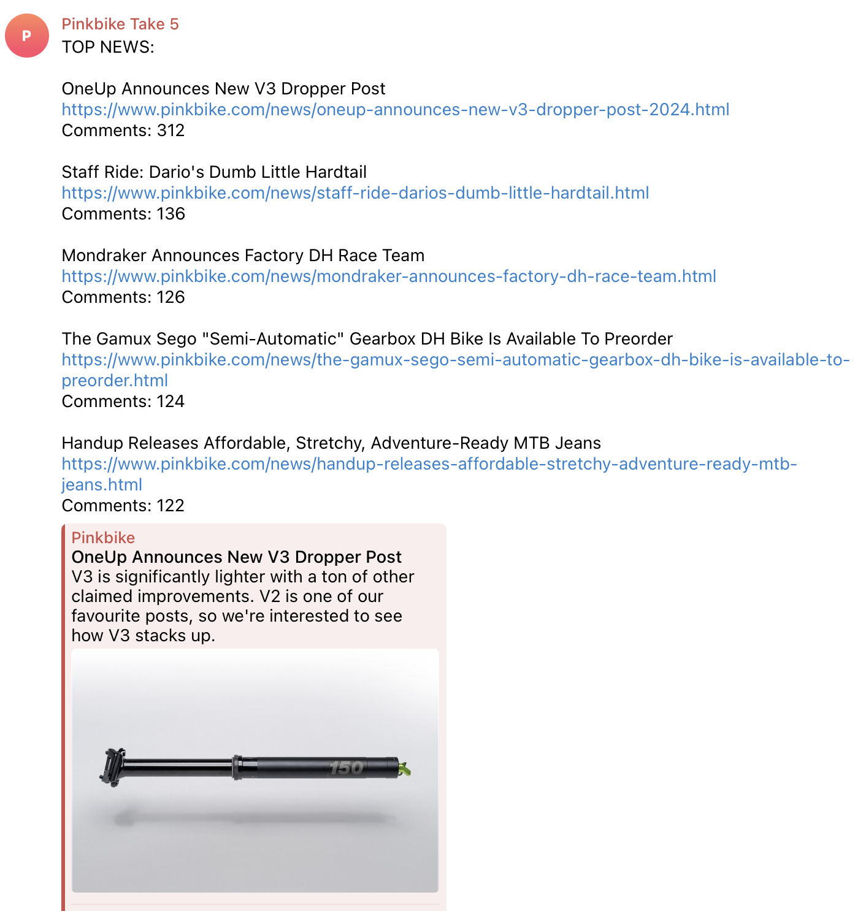

# pinkbike-scraper

http://www.pinkbike.com/

Pinkbike is the world's largest mountain biking community, covering the latest in cycling and mountain biking news, videos, photos, events, results, and more.

## Описание сайта:

Об этом сайте знает практически каждый владелец горного велосипеда в мире. Аудитория около 7 млн человек ежемесячно (Category Rank #1 > Sports > Cycling and Biking -- In United States). 

В чем особенность этого сайта: у каждой статьи есть обязательно комментарии, и чем их больше тем лучше, то есть либо статья очень интересная, либо кто-то хорошо пошутил в комментах, либо обсуждения важные происходят и т.д.
Даже есть шутка такая -- что пользователи сначала читают заголовок, потом сразу идут в комменты ;) там же самое интересное)

Так вот. Информации каждые сутки добавляется достаточно много. 
Идея в том, чтобы парсить сайт и находить статьи с большим числом комментов (к примеру за сутки / неделю), сортировать, метрики считать и выводить пользователю(отправлять в Телеграм канал).
На самом сайте сортировать статьи по популярности и количеству комментов нельзя.

## Что было сделано:

Задание выполнено в рамках курса по Big Data магистратуры ФКН МОВС ВШЭ.

Был написан Airflow DAG (Directed Acyclic Graph) и набор вспомогательных функций.

После парсинга главной страницы сайта (NEWS) и раздела с событиями/соревнованиями (EVENTS) полученный контент передается в Телеграм-канал,
сохраняется на HDFS в parquet.
Далее считается основная статистика, затем (используя MySQl) передаем полученные значения для визуализации в DataLens.

Описанная выше процедура происходит каждые 4 часа.

## Примеры:

